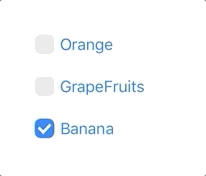
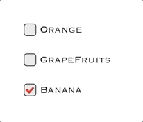
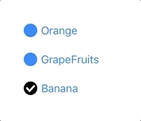

# YSCheckBox
YSCheckBoxは簡単に使えるiOS用のswift製チェックボックスライブラリです。  

　
　
　
# Features
ブラウザ標準のようなチェックボックスです。

# Installation
### CocoaPods

1. Podfileに `pod 'YSCheckBox', :git => 'https://github.com/sekies/YSCheckBox.git'` と追加します。
1. pod install します。


# Usage
1. YSCheckBoxをインポートします。
 ```Swift
 import YSCheckBox
 ```
2. 任意のUIViewContorollerで`YSCheckBoxViewControllerDelegate` プロトコルに準拠します。
 ```Swift
 class ViewController: UIViewController,YSCheckBoxViewControllerDelegate {
 ```
3. `YSCheckBoxViewController`インスタンスを生成します。生成時にチェックボックスのラベルを配列で指定します。  
  ```Swift
  let checkBox = YSCheckBoxViewController(labels: ["Orange","GrapeFruits","Banana"])
  ```
4. delegateと各種デザインプロパティを設定します。必須となるのはdelegateのみです。
  ```Swift
checkBox.delegate = self
checkBox.font = UIFont.systemFont(ofSize: 18)
checkBox.labelColor = UIColor(red: 0, green: 122 / 255, blue: 1, alpha: 1)
checkBox.labelMargin = 0
checkBox.lineWidth = 1
checkBox.checkBoxSelectedFillSize = 1
checkBox.checkBoxMargin = 6
checkBox.checkBoxCorner = 7
checkBox.checkBoxStroke = .lightGray
checkBox.checkBoxCheckStroke = .white
checkBox.checkBoxSelectedFill = UIColor(red: 0, green: 122 / 255, blue: 1, alpha: 1)
checkBox.checkBoxBGFill = UIColor(red: 0.95, green: 0.95, blue: 0.95, alpha: 1)
  ```
4. 親UIViewControllerに生成したYSCheckBoxViewControllerをaddChildしコンテナとなるUIViewにYSCheckBoxViewControllerのviewをaddSubviewします。チェックボックスの位置はコンテナとなるUIViewに依存します。
  ```Swift
addChild(checkBox)
checkBox.view.frame = container.bounds
container.addSubview(checkBox.view)
checkBox.didMove(toParent: self)
  ```
5. デリゲートメソッドを実装します。チェックボタンを選択するとこのメソッドが呼ばれます。YSCheckBoxViewController生成時に追加した配列の順にBoolが割り振られます。
  ```Swift
  func didYSCeckBoxSelect(checks: [Bool]) {
      print(checks)
  }
  ```
